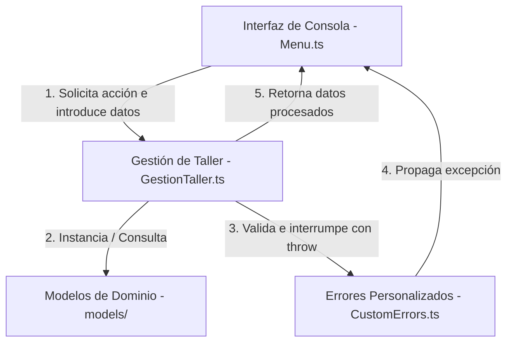

# Arquitectura del Sistema - AutoService Express

Este documento describe la arquitectura de software y la estructura de archivos del sistema de gestión para el taller mecánico **"AutoService Express"**, desarrollado utilizando Programación Orientada a Objetos (POO) con TypeScript y Node.js.

## Principios de Diseño

El sistema está diseñado bajo principios fundamentales de ingeniería de software para asegurar un código limpio, extensible y modular:

1. **Separación de Responsabilidades (Single Responsibility Principle):** Cada directorio y clase tiene una única responsabilidad bien definida (ej. separar la presentación de la lógica de negocio).
2. **Encapsulamiento:** Las clases protegen sus datos internos utilizando modificadores de acceso (`private` y `protected`), exponiendo la información y comportamientos necesarios únicamente mediante métodos públicos y descriptivos.
3. **Herencia y Polimorfismo:** Implementación de jerarquías de clases para la reutilización de código (Personas y Vehículos) y comportamiento polimórfico en métodos compartidos.
4. **Manejo de Errores Desacoplado:** Centralización de excepciones personalizadas para garantizar la estabilidad del sistema sin sobrecargar la lógica de negocio.

---

## Estructura de Directorios

La estructura de carpetas bajo el directorio `src/` está organizada de la siguiente manera:

```text
src/
├── main.ts                   # Punto de entrada de la aplicación
├── cli/                      # Capa de presentación / Interfaz de usuario
│   └── Menu.ts               # Lógica interactiva en consola (Readline)
├── models/                   # Clases del dominio de datos (POO pura)
│   ├── Persona.ts            # Clase abstracta base para personas
│   ├── Cliente.ts            # Entidad Cliente (hereda de Persona)
│   ├── Mecanico.ts           # Entidad Mecánico (hereda de Persona)
│   ├── Vehiculo.ts           # Clase abstracta base para vehículos
│   ├── Sedan.ts              # Entidad Vehículo Sedán (hereda de Vehículo)
│   ├── Moto.ts               # Entidad Vehículo Moto (hereda de Vehículo)
│   ├── Repuesto.ts           # Representación de piezas físicas del taller
│   ├── Reparacion.ts         # Registro y cálculo del servicio de reparación
│   └── Factura.ts            # Comprobante financiero formateado
├── services/                 # Capa de orquestación y lógica
│   └── GestionTaller.ts      # Controlador principal y base de datos simulada en RAM (arreglos)
├── errors/                   # Excepciones personalizadas
│   └── CustomErrors.ts       # Errores específicos del negocio
└── tests/                    # Pruebas unitarias (Jest)
    ├── models/               # Pruebas para clases del dominio
    └── services/             # Pruebas para el controlador e integraciones
```

---

## Descripción de Módulos y Archivos

### 1. Punto de Entrada
* **`src/main.ts`:** Inicializa la aplicación y arranca el ciclo principal de la interfaz interactiva definida en la carpeta `cli`. No contiene lógica de negocio.

### 2. Capa de Presentación (CLI)
* **`src/cli/Menu.ts`:** Implementa el menú por consola para el usuario. Lee la entrada del teclado, valida formatos básicos de datos utilizando `ReadLine` y muestra respuestas estilizadas. Llama a los métodos de la capa de servicios para procesar los datos de entrada.

### 3. Modelos de Dominio (Models)
* **`src/models/Persona.ts`:** Clase abstracta base. Contiene atributos comunes como nombre, identificación y contacto. Define el método abstracto `obtenerIdentificacion()`.
* **`src/models/Cliente.ts`:** Subclase que hereda de `Persona`. Añade atributos como la lista de vehículos asociados al cliente y métodos específicos para gestionar su historial. Sobrescribe `obtenerIdentificacion()`.
* **`src/models/Mecanico.ts`:** Subclase que hereda de `Persona`. Añade atributos de especialidad y estado de disponibilidad. Sobrescribe `obtenerIdentificacion()`.
* **`src/models/Vehiculo.ts`:** Clase abstracta base. Define propiedades comunes del vehículo (placa, marca, modelo, año) y firma el método abstracto `obtenerTipo()`.
* **`src/models/Sedan.ts` & `src/models/Moto.ts`:** Clases concretas que heredan de `Vehiculo`. Implementan el método `obtenerTipo()` y pueden incluir coeficientes de cobro por reparación o mantenimientos específicos según el tipo de transporte.
* **`src/models/Repuesto.ts`:** Clase que modela un ítem del inventario (código, nombre, precio, cantidad en stock).
* **`src/models/Reparacion.ts`:** Modela el proceso de reparación asignado a un vehículo y a un mecánico. Almacena el estado del servicio (`'Pendiente'`, `'En Progreso'`, `'Completado'`), la mano de obra, los repuestos utilizados y calcula el subtotal.
* **`src/models/Factura.ts`:** Modela el comprobante de pago emitido al cliente. Realiza los cálculos de impuestos correspondientes y formatea el reporte de salida en terminal de manera limpia.

### 4. Orquestación y Lógica (Services)
* **`src/services/GestionTaller.ts`:** El cerebro operativo del backend. Administra las colecciones en memoria RAM (arreglos de vehículos, clientes, mecánicos, reparaciones y repuestos). Contiene los métodos para crear registros, buscar elementos, asociar mecánicos a reparaciones y simular la lógica de persistencia mientras dure activa la sesión de la consola.

### 5. Manejo de Errores (Errors)
* **`src/errors/CustomErrors.ts`:** Agrupa excepciones personalizadas del negocio (por ejemplo, `VehiculoInexistenteError`, `StockInsuficienteError`) que extienden la clase `Error` nativa de TypeScript. Esto permite separar las validaciones críticas del flujo normal y facilita el uso limpio de bloques `try-catch`.

---

## Flujo General de Operación

El flujo típico de información sigue un camino lineal e intuitivo:



1. El usuario interactúa con la terminal en `Menu.ts`.
2. `Menu.ts` llama al orquestador en `GestionTaller.ts` con los parámetros correspondientes.
3. `GestionTaller.ts` crea o actualiza las entidades que viven en `models/`.
4. Si hay inconsistencias (ej. buscar un vehículo que no existe o consumir un repuesto agotado), `GestionTaller.ts` lanza una excepción importada de `CustomErrors.ts`.
5. `Menu.ts` captura el error mediante un bloque `try-catch`, muestra el mensaje amigable al usuario en pantalla y continúa con la ejecución de la consola sin interrumpir el programa de forma abrupta.
