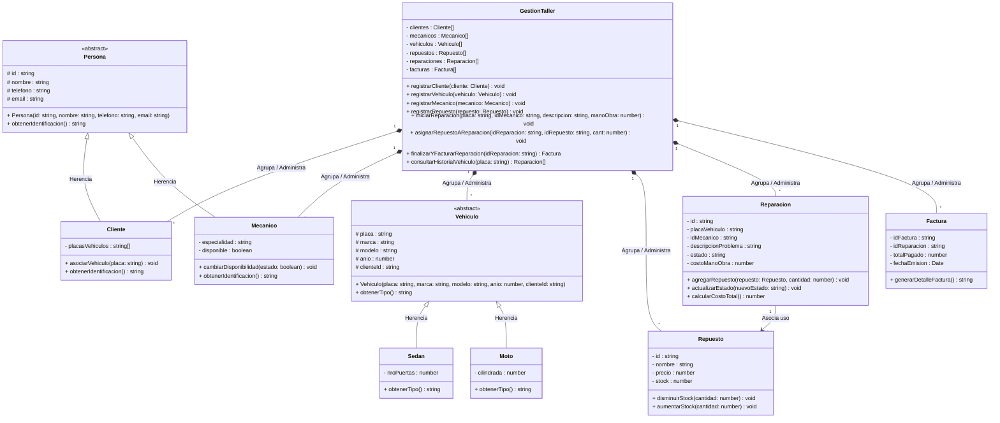

# Diagrama de Clases - AutoService Express

A continuación se muestra el diagrama de clases del sistema para el taller mecánico:

```mermaid
classDiagram
    %% --- Clases Abstractas ---
    class Persona {
        <<abstract>>
        # id : string
        # nombre : string
        # telefono : string
        # email : string
        + Persona(id: string, nombre: string, telefono: string, email: string)
        + obtenerIdentificacion() string
    }

    class Vehiculo {
        <<abstract>>
        # placa : string
        # marca : string
        # modelo : string
        # anio : number
        # clienteId : string
        + Vehiculo(placa: string, marca: string, modelo: string, anio: number, clienteId: string)
        + obtenerTipo() string
    }

    %% --- Relaciones de Herencia ---
    class Cliente {
        - placasVehiculos : string[]
        + asociarVehiculo(placa: string) void
        + obtenerIdentificacion() string
    }

    class Mecanico {
        - especialidad : string
        - disponible : boolean
        + cambiarDisponibilidad(estado: boolean) void
        + obtenerIdentificacion() string
    }

    class Sedan {
        - nroPuertas : number
        + obtenerTipo() string
    }

    class Moto {
        - cilindrada : number
        + obtenerTipo() string
    }

    %% --- Clases de Soporte ---
    class Repuesto {
        - id : string
        - nombre : string
        - precio : number
        - stock : number
        + disminuirStock(cantidad: number) void
        + aumentarStock(cantidad: number) void
    }

    class Reparacion {
        - id : string
        - placaVehiculo : string
        - idMecanico : string
        - descripcionProblema : string
        - estado : string
        - costoManoObra : number
        + agregarRepuesto(repuesto: Repuesto, cantidad: number) void
        + actualizarEstado(nuevoEstado: string) void
        + calcularCostoTotal() number
    }

    class Factura {
        - idFactura : string
        - idReparacion : string
        - totalPagado : number
        - fechaEmision : Date
        + generarDetalleFactura() string
    }

    %% --- Clase Orquestadora (Controlador en Memoria) ---
    class GestionTaller {
        - clientes : Cliente[]
        - mecanicos : Mecanico[]
        - vehiculos : Vehiculo[]
        - repuestos : Repuesto[]
        - reparaciones : Reparacion[]
        - facturas : Factura[]
        + registrarCliente(cliente: Cliente) void
        + registrarVehiculo(vehiculo: Vehiculo) void
        + registrarMecanico(mecanico: Mecanico) void
        + registrarRepuesto(repuesto: Repuesto) void
        + iniciarReparacion(placa: string, idMecanico: string, descripcion: string, manoObra: number) void
        + asignarRepuestoAReparacion(idReparacion: string, idRepuesto: string, cant: number) void
        + finalizarYFacturarReparacion(idReparacion: string) Factura
        + consultarHistorialVehiculo(placa: string) Reparacion[]
    }

    %% --- Definición de Relaciones ---
    Persona <|-- Cliente : Herencia
    Persona <|-- Mecanico : Herencia
    Vehiculo <|-- Sedan : Herencia
    Vehiculo <|-- Moto : Herencia 

    GestionTaller "1" *-- "*" Cliente : Agrupa / Administra
    GestionTaller "1" *-- "*" Mecanico : Agrupa / Administra
    GestionTaller "1" *-- "*" Vehiculo : Agrupa / Administra
    GestionTaller "1" *-- "*" Repuesto : Agrupa / Administra
    GestionTaller "1" *-- "*" Reparacion : Agrupa / Administra
    GestionTaller "1" *-- "*" Factura : Agrupa / Administra

    Reparacion "1" --> "*" Repuesto : Asocia uso
```
